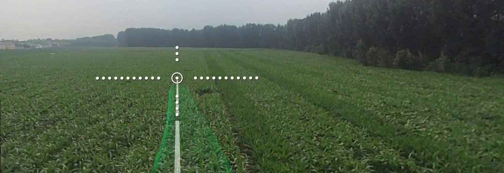
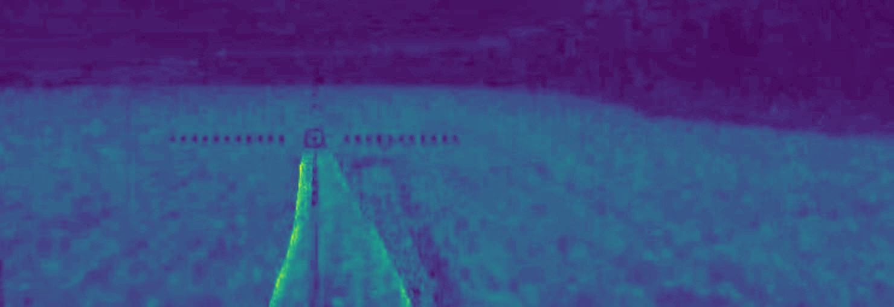
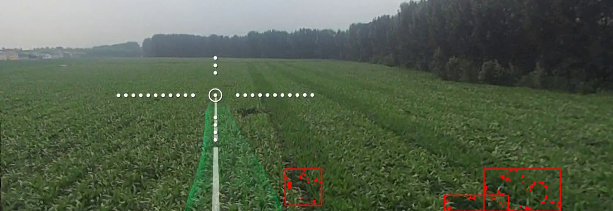
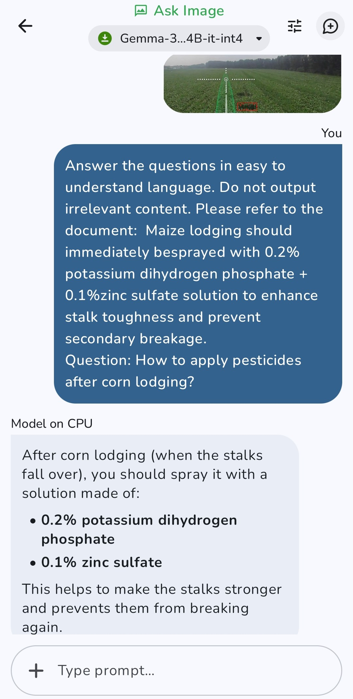

# FieldLens: A Private, Offline AI Assistant for Detecting Corn Abnormalities

## Introduction

Corn farming, especially in remote and rural areas, often faces a critical challenge: identifying plant growth problems like sparse emergence or pest damage at an early stage—before it's too late. These issues typically emerge during sensitive phases such as tasseling, when quick intervention is crucial for protecting yields. However, many farmers lack the tools, expertise, or connectivity to detect and interpret these problems in time. What makes this challenge more severe is that visual abnormalities o...

To solve this, we developed **FieldLens**: an offline-first, on-device AI assistant that analyzes cornfield drone videos, detects abnormal regions (such as sparse growth), and guides the user to generate intelligent questions about the observed issues. These questions are then routed to a local language model interface powered by **Gemma 3n**, which produces structured, multimodal answers based on retrieved context and visual evidence. Unlike cloud-based AI tools, FieldLens is designed for low-connectivi...

This ensures real-time, private, and actionable support for farmers, right in the field, without needing the internet.

In this project, we demonstrate how the unique capabilities of Gemma 3n—such as on-device performance, multimodal understanding, and flexible prompt-based reasoning—enable a new kind of practical, deployable agricultural intelligence.

## Approach

The **FieldLens** pipeline begins with video input—typically drone or handheld footage captured in the field. To maintain full offline capability, all subsequent processing is performed on-device. From each video, representative frames are extracted and passed through a lightweight visual pipeline to:

- Detect crop anomalies  
- Generate domain-specific questions  
- Construct multimodal prompts for reasoning with **Gemma 3n**

### Overview of Three Components:

1. **Anomaly Detection** (thresholding + morphology)  
2. **Question Generation** (template-based, RAG-style)  
3. **Multimodal Reasoning** (Gemma 3n-compatible prompts)

### 1. Anomaly Detection (Thresholding + Morphology)

Sparse crop regions exhibit lower green intensity and spatial discontinuity. We compute the **Excess Green Index (ExG)** to enhance vegetation contrast:

- **ExG** = 2G - R - B  
- Normalize to 8-bit grayscale  
- Thresholding: T = 60  
- Morphological filtering (Open → Close, 7×7 elliptical kernel)  
- Connected components: Area ≥ 2000 px  
- Top 50% of the image is masked to ignore horizon/sky

**Output**: Binary mask highlighting sparse growth areas.

### 2. Question Generation (Template-based, RAG-style)

Visual outputs are enriched with structured language prompts to produce actionable insights. A RAG-style method retrieves related domain knowledge and injects it into the prompt.

#### Semantic Retrieval:

- **Embedding Model**: Qwen3-Embedding-0.6B  
- **Vector Store**: Milvus or FAISS  
- **Top-k Retrieval**: 2  
- **Similarity**: Cosine  

#### Prompt Template:

```
Based on <retrieved_text>, answer <question>
```

All operations are **fully offline** and optimized for Android deployment.

### 3. Multimodal Reasoning (Gemma 3n-compatible Prompts)

We use **Gemma-3n-E4b-it-int4** for local reasoning with visual + textual input.

- **Prompt format**:  
  ```
  <image_soft_token> In this image, <question>
  ```
- **Inputs**: Image + Text  
- **Outputs**: Natural language answers grounded in both visual and semantic evidence  
- **Deployment**: Google Edge Gallery, ONNX/mobile-compatible

## System Demo

We simulate the entire pipeline step-by-step using real aerial footage:

### 1. Input Image

Raw drone frame captured from a cornfield.

  
**Figure 1**: Original RGB Image

### 2. Anomaly Detection

ExG-based segmentation and morphological filtering reveal sparse areas.

  
**Figure 2**: ExG Vegetation Index Map

  
**Figure 3**: Binary Anomaly Mask

  
**Figure 4**: Annotated Image with Red Boxes

### 3. Question Generation

Structured prompts built for each anomaly.

- **Question**: What causes sparse crop growth here?  
- **Retrieved Text**: "According to agronomic guidelines, pest activity increases in the tasseling stage..."  
- **Prompt**:  
  ```
  Please answer <question> based on <retrieved_text>
  ```

### 4. Multimodal Reasoning

  
**Figure 5**: Multimodal reasoning example using a Gemma 3n-compatible prompt

### Interactive Demo

Due to offline design (local Android deployment), we do not provide a live cloud demo.  
However, we created a **web-based walkthrough** simulating the app flow:

🔗 [https://tianmiao11.github.io/FieldLens/](https://tianmiao11.github.io/FieldLens/)

## Future Improvements

### 1. Enhanced Anomaly Classification  
Support multiple crop stress types (drought, disease, lodging) using multi-class segmentation and phenological phase adaptation.

### 2. Multimodal Reasoning on Drones  
Embed quantized models onto agricultural drones for **fully autonomous** and **offline** decision-making.

### 3. Field-Level Reporting  
Aggregate frame-level detections into a full-field diagnostic report with spatial analytics and drone-action guidance (e.g. spraying, replanting).

## Outro

The pipeline—**anomaly detection**, **question generation**, and **multimodal reasoning**—is **crop-agnostic** and expandable to other domains like forestry or conservation.

This project represents a **new class of edge AI systems**, combining **multimodal models like Gemma 3n** with traditional agricultural hardware. The result: private, offline, field-deployable intelligence that helps farmers act—without needing the cloud.